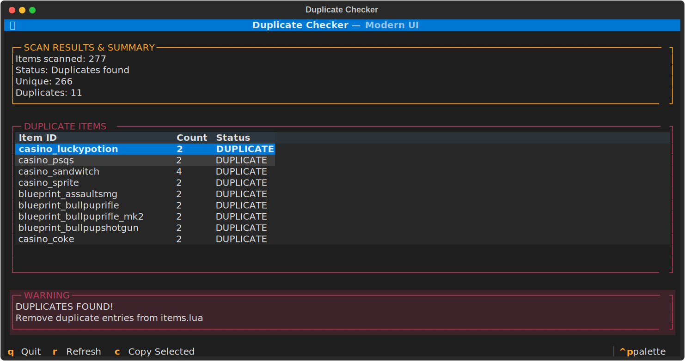

# FiveM ox_inventory Duplicate Item Checker

[](https://fivem.net/)
[](https://github.com/CommunityOx/ox_inventory)
[](https://python.org/)
[](LICENSE)

**Fast and reliable tool to find duplicate item IDs in FiveM ox_inventory `items.lua` files.** Prevents server crashes and inventory errors by detecting duplicate item definitions before they cause problems.

## What it does
Scans your `items.lua` file and finds duplicate item IDs that can cause server errors. Perfect for FiveM server administrators using ox_inventory to maintain clean item configurations and prevent inventory system conflicts.

## Features
- **Interactive UI** - Modern terminal interface
- **Progress bar** - Shows scanning progress
- **Copy duplicates** - Copy item names to clipboard
- **Fast scanning** - Works with large files
- **Clear results** - Shows exactly what duplicates were found

## Example Output



## Installation
```bash
pip install -r requirements.txt
```

## Usage
1. Put `duplicate_checker.py` in same folder as `items.lua`
2. Run: `python duplicate_checker.py`
3. Use keyboard shortcuts:
   - `R` - Refresh scan
   - `C` - Copy selected duplicate
   - `Q` - Quit

## What it checks
- Finds duplicate item IDs like `['lighter']` in your `items.lua`
- Shows how many times each item appears
- Only checks item IDs, not labels or other fields

## FAQ
**Q: Why do I need this tool?**  
A: Duplicate item IDs in ox_inventory can cause server crashes, inventory bugs, and item conflicts. This tool helps you find and fix them before they cause problems.

**Q: Does it work with other inventory systems?**  
A: This tool is specifically designed for ox_inventory `items.lua` files. It won't work with other inventory systems.

**Q: Is it safe to use?**  
A: Yes! This tool only reads your `items.lua` file and doesn't modify anything. It's completely safe to use on production servers.

## Keywords
FiveM, ox_inventory, duplicate checker, item scanner, inventory tool, Lua checker, FiveM utility, terminal UI, progress bar, clipboard, item detection, duplicate detection, ox_inventory items, FiveM inventory, item scanner, duplicate scanner, ox_inventory scanner, FiveM duplicate checker, inventory duplicate finder, ox_inventory duplicate finder, item ID checker, FiveM item checker, ox_inventory item checker, duplicate item finder, FiveM duplicate item finder, ox_inventory duplicate item finder, item duplicate detector, FiveM item duplicate detector, ox_inventory item duplicate detector, duplicate item scanner, FiveM duplicate item scanner, ox_inventory duplicate item scanner, item ID duplicate checker, FiveM item ID duplicate checker, ox_inventory item ID duplicate checker, duplicate item ID finder, FiveM duplicate item ID finder, ox_inventory duplicate item ID finder, item duplicate ID detector, FiveM item duplicate ID detector, ox_inventory item duplicate ID detector, duplicate item ID scanner, FiveM duplicate item ID scanner, ox_inventory duplicate item ID scanner

## License
MIT License - see [LICENSE](LICENSE) file for details.

**Created by Marius.**